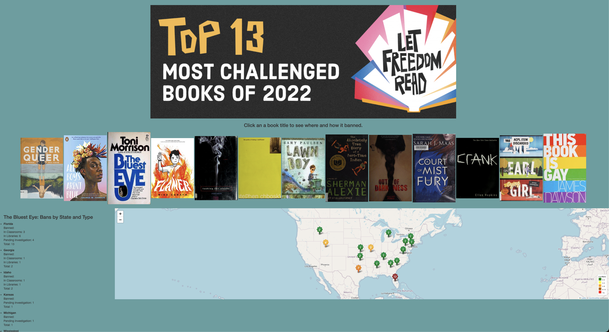

# Book_bans_USA
A study of recent book bans in the United States.

#### Project 3: Columbia School of Engineering Data Analytics Bootcamp
Authors: Jennifer Kim, Kat McEldowney and Scott Zuckerbrow
Date: March 4, 2024

### Introduction

Lately we’ve been hearing about a rise in book bans in schools and libraries across the United States from the [news](https://www.nytimes.com/news-event/bookbans). Research on formal or attempted book bans is limited and has yet explored in depth. We decided to find data on book bans and visualizing them in an informative and interactive map.

### Methods

The goals of this project were to explore the latest trends in book bans across the U.S. and visualize them in an interactive dashboard with book covers as clickable buttons and a map showing the selected title's information. We also graphed the distribution of book bans by title and state as a bar chart.

#### Data Sources

##### The American Library Association (ALA)

The American Library Association collects data on book challenges from reports filed by library professionals and from news stories. The ALA’s Office for Intellectual Freedom puts together a list of most challenged books annually—we decided to showcase 13 most challenged titles in 2022 provided by the ALA for this project. A top banner in our end result directs you to this list of most challenged titles on the ALA’s website. While the ALA released a report summarizing its most recent findings last September, the data analyzed to generate this press release were not publicly available.

##### PEN America

PEN America is a nonprofit literary organization that strives to raise awareness for the protection of free expression. PEN’s work includes research and reports on topical issues including book bans in libraries and classrooms, similar to how the ALA collects and keeps track of book bans.

PEN America tracks instances where students’ access to books in school libraries and classrooms in the United States is restricted for limited or indefinite periods of time. Instances of book bans are recorded based on publicly reported data from journalists, school district websites, and school board minutes. It has compiled these instances over a year and a half from 7/1/2021-12/31/2022 as an Index of School Book Bans, which could be downloaded as CSV files. There are four discrete categories of bans in this Index dataset: banned in libraries and classrooms, banned in libraries, banned in classrooms, and banned pending investigation. An affected title could fall into these categories of bans depending on the district. PEN America’s [website](https://pen.org/report/banned-in-the-usa-state-laws-supercharge-book-suppression-in-schools) has more details regarding this categorization of book bans.

##### Open Library

Open Library is an online universal catalog for book metadata where anyone could access and contribute information on every book ever published. We retrieved data on the 13 most challenged titles in 2022 to give a quick overview of each book on our dashboard.

#### Definitions

The process of banning a book starts with an individual issuing the challenge. The ALA defines a challenge as “an attempt to remove or restrict materials, based upon the objections of a person or group.” In other words, a challenge indicates that the process towards banning the book has been initiated but does not guarantee an official ban. 

Once a challenge is made, the institution in question can either ban the book from the premises, or deny the challenge. A formal challenge leads to the reconsideration of the decision to purchase the material or offer the service. This process is governed by a board-approved policy and includes review of the material to determine if it is aligned with the library or school's mission and criteria.

A book is banned when it is entirely removed from the curriculum, library, or store in question. Bans are executed on an institutional basis, meaning if a book is banned in one place, it’s not banned in others. A book can be banned due to racial issues, sexual situations or dialog, violence, presence of witchcraft, political bias, and other reasons.

#### Data Engineering

We imported data into Jupyter Notebook (`starter_code.ipynb`) from three different sources: ALA, PEN America, and Open Library.

The PEN America’s Index of Book Bans data were read in and converted to Pandas DataFrames from two CSV files. The Index dataset originally had 10 columns: author, title, type of ban, secondary authors, illustrators, translators, state, district, date of challenge, and origin of challenge. We dropped some columns to keep the data at state-level and added count columns tallying up a number of school districts within a state where a particular title is challenged. Because the Index dataset combined banned in libraries and schools in one row, we separated the ban types into two rows for each pertinent title. The Index DataFrame was subset to the ALA’s 13 most challenged titles in 2022. Our final book ban DataFrame contained 13 unique titles, 149 rows, and 7 columns including the title, state, and counts of different bans.

We performed an API call to Open Library to retrieve information of the most challenged titles listed by the ALA as mentioned above. Information from this API call included the book’s title, author, publisher, publication date and cover image, which was saved as a JSON file (`data/book_info.json`). 

#### Data Visualization

An interactive dashboard was programmed in HTML, JavaScript and CSS. The dashboard can be accessed by visiting this deployed webpage: [link].

On top of the dashboard, there are 13 buttons representing most challenged titles from the ALA with their respective book images obtained from Open Library. When you hover over a book, basic information including its title, author, publisher and publish date pops up.

Once a book is clicked, it shows which states, how many school districts and what types of bans that selected title is restricted on a map and a side panel below the tiles. The markers on the map represent a total number of districts that banned the selected book in that state. We also colored the markers, from green as the lowest total bans (less than 3) to red as the highest total bans (greater than or equal to 12).

A dropdown menu on the bottom of the webpage lets the user select between two bar graphs showing the distribution of ban types by state for all titles or for the 13 most challenged titles with the choice to have the states arranged by adult literacy rates or 4th grade reading proficiency. A [link](https://worldpopulationreview.com/state-rankings/us-literacy-rates-by-state) is provided to show where the literacy statistics came from.

### Limitations and Implications

As we were searching for data, we learned that there is no established surveillance system for book bans in the U.S.  It is important to note that book bans take different forms—some titles might have restricted access in libraries, classrooms or both depending on the school district, and some bans may be temporary. Because not all book challenges are reported or covered by the press, the data we explored represent only a snippet of book challenges or bans.

While the creators of this dashboard encourage reading from a diverse selection of books for students, it's important to clarify that the purpose of this project was not to take a stance in the ongoing debate about whether books should be banned or to influence the audience's political beliefs.